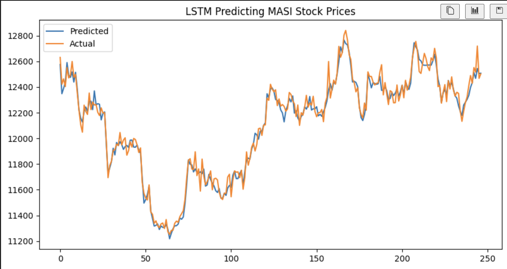
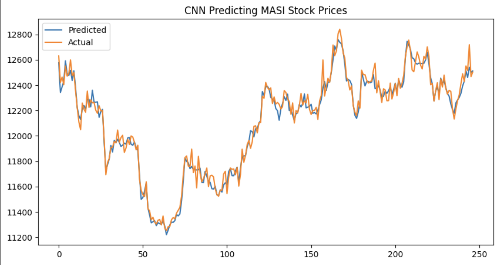

# Stock Price Prediction Using LSTM

## Overview

This project uses a variety of machine learning models including LTSM, CNN, and feedforward neural networks to predict the next day’s MASI (Moroccan All Shares Index) stock price based on past stock data. LSTMs are a type of Recurrent Neural Network (RNN) capable of learning long-term dependencies in sequential data, making them suitable for time series prediction like stock prices. CNNs are another type of neural networks which picks up patterns using kernels, while feedforward are basic neural network with hidden layers.

## Dataset

- Historical stock data in CSV format found in https://www.kaggle.com/datasets/aymanlafaz/moroccan-stock-prices.  

## Requirements

- Python 3.x  
- Libraries:
  - pandas
  - numpy
  - scikit-learn
  - tensorflow
  - matplotlib

## Results

After evaluating the model on unseen test data, we obtained the following predictions compared to the actual stock prices. The plot below illustrates how well the LSTM captures the trends in the stock prices over time:

